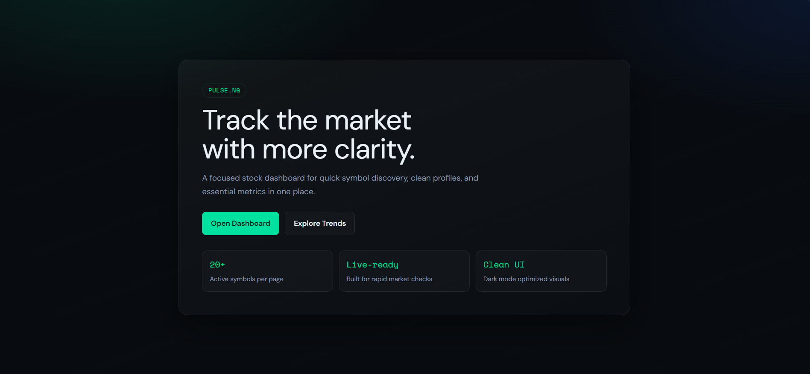
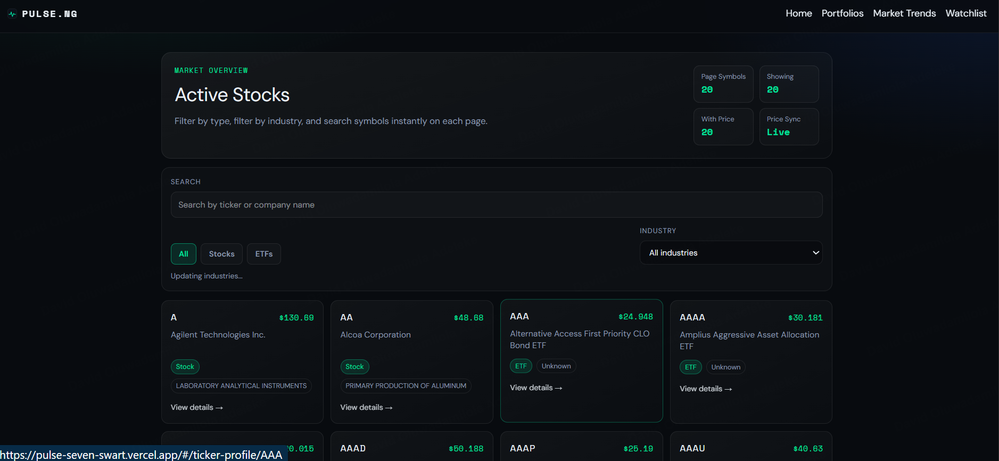
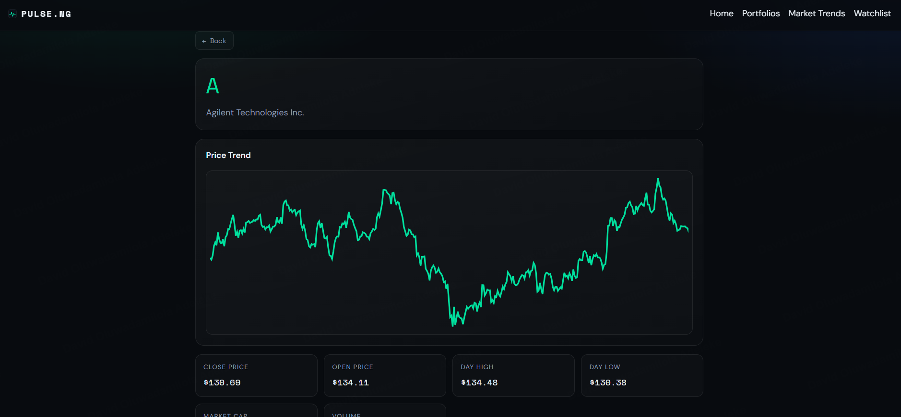

# PULSE.NG

A focused stock market dashboard for quick symbol discovery, clean company profiles, and essential market metrics in one place.

🔗 **Live app:** [pulse-seven-swart.vercel.app](https://pulse-seven-swart.vercel.app/)

## Overview

PULSE.NG is a stock dashboard built for fast market checks rather than cluttered, data-heavy terminals. It surfaces active stocks and ETFs, lets users search and filter by type and industry, and gives each symbol a dedicated profile page with price trend charts and key metrics like open, close, day high, day low, market cap, and volume.

## Preview

**Landing page**



**Active stocks dashboard**



**Ticker profile page**



## Features

- **Market Overview** – Live-updating snapshot of active symbols, with counts for total symbols, symbols with pricing, and price sync status
- **Search & Filter** – Instant search by ticker or company name, with filters for stock type (Stocks / ETFs) and industry
- **Ticker Profiles** – Dedicated page per symbol with a price trend chart and key metrics (close, open, day high, day low, market cap, volume)
- **Portfolios** – Track and organize symbols of interest
- **Market Trends** – Broader view of market movement beyond individual symbols
- **Watchlist** – Save symbols for quick access
- **Dark Mode Optimized UI** – Built for clarity during rapid market checks

## Tech Stack

| Layer | Technology |
|---|---|
| Framework | React |
| Routing | TanStack Router |
| Language | TypeScript |
| Market Data | Polygon.io API |
| Deployment | Vercel |

## Getting Started

### Prerequisites

- Node.js (v18 or higher recommended)
- A Polygon.io API key

### Installation

1. Clone the repository
```bash
git clone <repository-url>
cd pulse-ng
```

2. Install dependencies
```bash
npm install
```

3. Set up environment variables

Create a `.env` file in the root directory:
```
VITE_POLYGON_API_KEY=your_polygon_api_key
```

4. Run the development server
```bash
npm run dev
```

## Project Structure

```
pulse-ng/
├── src/
│   ├── components/     # Reusable UI components
│   ├── pages/           # Route-level page components (dashboard, ticker profile, etc.)
│   ├── features/         # Feature-specific logic (search, filters, watchlist, portfolios)
│   ├── lib/              # Polygon.io client and utility functions
│   ├── hooks/            # Custom React hooks
│   └── routes/           # TanStack Router route definitions
└── public/
```

## Deployment

PULSE.NG is deployed and live at **[pulse-seven-swart.vercel.app](https://pulse-seven-swart.vercel.app/)**.

| Layer | Provider |
|---|---|
| Frontend | Vercel |
| Market Data | Polygon.io |

Pushing to the main branch triggers a new deployment on Vercel automatically. The Polygon.io API key is configured as an environment variable in the Vercel project settings rather than committed to the repo.

## Roadmap

- Custom watchlist alerts
- Portfolio performance tracking
- Historical data comparisons across symbols
- Mobile-responsive polish

## Contributing

This project is currently maintained as a solo portfolio project. Feedback and suggestions are welcome through issues.

## License

MIT